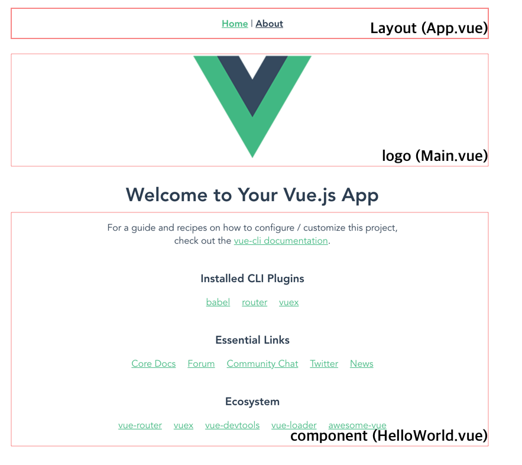

# 달라진 Vue Cli 4

Vue Cli 4 에서 달라진 부분이 있어서 오늘 구조와 공유를 드리고자 합니다.

vue-cli 로 프로젝트를 새로 생성했는데, 오호 무언가 달라진게 있었네요.

## 신규 버젼 확인

제가 설치한 vue-cli 버젼은 다음과 같습니다.

```
sudo npm install -g @vue/cli
```

위 명령어로 실행하고 버젼을 확인해 보겠습니다

```
vue --version

@vue/cli 4.2.2
```

현제 제가 사용하는 버젼은 4.2.2 이네요.

## 프로젝트 생성하기.

```
vue create my-vue-test

...

 $ cd vue-ppt
 $ npm run serve
```

위와 같이 나타납니다.

## Directory 구조 확인하기.

디렉토리는 다음과 같이 확인됩니다.

- node_modules: 노드 모듈이 설치되는 위치입니다.
- public: 정적 정보가 저장되는 디렉토리 입니다.
  - favicon.ico: 파비콘 파일이 존재합니다. (브라우저 탭에서 보이는 아이콘입니다.)
  - index.html: 메인 인덱스 페이지입니다. `<div id="app"></div>`
- src: vue.js 관련 파일이 저장되는 디렉토리이며, 우리는 이 디렉토리에서 대부분의 작업을 수행합니다.
  - assets: vue 에서 연동되어 화면에 위치될 정적 파일들, 이미지들이 들어가는 디렉토리입니다. (앞으로 이미지는 여기에 추가합니다.)
    - logo.png: 대표적인 vue.js 로고입니다.
  - components: 컴포넌트가 저장됩니다. 컴포넌트는 vue.js 에서 특정 페이지 내에 들어가는 화면 조각입니다.
    - HelloWorld.vue: 샘플에서 홈 영역 하단에 관련 링크 영역 부분을 담당합니다.
  - router: router 는 메뉴를 클릭했을때 화면 전환을 수행하도록 하는 기능을 말합니다. 이 부분은 전에 없었던 부분이었는데 버젼업이 되면서 추가 되었네요. 이 디렉토리에서 화면전환인 router 소스가 포함됩니다.
    - index.js: 라우팅을 수행할 소스가 포함됩니다. 잠시후 알아보겠습니다.
  - store: store 은 중앙화된 컴포넌트와 데이터의 상태를 관리장소를 말합니다. 컴포넌트 기반의 Front End 개발툴들이 데이터를 전달할때 props 를 계속 전달해야하는 복잡도를 해소하기 위해서 사용하는 상태 저장소가 store 입니다. 이 부분도 새로 사전 탑재가 되었네요. 이제 그냥 vuex 를 바로 사용할 수 있습니다.
    - index.js: vuex 파일입니다. 이 부분도 소스를 확인해보겠습니다.
  - views: 화면을 만들어 주는 파일들입니다. 컴포넌트와 차이점은 views 는 화면 및 레이아웃등의 파일이 들어가고, components 는 화면내부에 들어갈 컨텐츠 부분이라고 생각하면 됩니다.
    - About.vue: About 링크를 클릭한경우 나타나는 페이지입니다.
    - Home.vue: 페이지가 오픈이 되면 처음으로 보여지는 화면입니다.
  - App.vue: 이 파일은 Vue 가 실행될때 vue.js 화면 레이아웃을 담당하는 영역입니다. 이 부분에서 메뉴, 링크등을 추가할 수 있습니다. 물론 새로운 파일을 만들어서 레이아웃을 배치해도 됩니다.
  - main.js: vue가 실행되면 가장 처음으로 로드되는 진입지점입니다. main 을 통해서 public 의 index.html 과 연동하여 vue 가 렌더링됩니다.

## 실행 미리보기.

```
npm run serve

  App running at:
  - Local:   http://localhost:8080/
  - Network: http://192.168.0.10:8080/

  Note that the development build is not optimized.
  To create a production build, run npm run build.
```

이를 실행하면 브라우저에 다음과 같이 화면이 열립니다.



보시는바와 같이 위 화면은 몇가지 구간으로 나뉘어 져 있습니다. 

화면에 사각형된 부분에 볼드체로 된 파일을 확인하면 됩니다. 

## 가장 최초 로드되는 index.html

vue.js 가 실행되면 가장먼저 되는 파일이 바로 public/index.html 파일입니다. 

이 파일에서 가장 중요한 부분은 아래 내용입니다. 

```
...
    <div id="app"></div>
...
```

위 부분이 바로 vue 가 렌더링 되는 위치입니다. 

## vue 실행시 모듈을 로드하는 main.js

main.js 는 가장먼저 vue 모둘이 로드되는 파일입니다. 

```
import Vue from 'vue'
import App from './App.vue'
import router from './router'
import store from './store'

Vue.config.productionTip = false

new Vue({
  router,
  store,
  render: h => h(App)
}).$mount('#app')

```

위 부분에서 중요한 부분은 new Vue 이 부분입니다. 

뷰를 새로 생성하고, JSON 으로 라우터, 스토어, 렌더링 정보를 전달합니다. 

- router 는 메뉴 선택시 화면을 이동해야하는 소스입니다. 

- store 는 vuex 소스가 들어가 있는 위치입니다. 

- render 는 main.js 가 로드되고, 뷰를 화며으로 렌더링하는 파일을 전달합니다. h => h(App) 을 보니 App.vue 가 렌더링 하라는 의미입니다. 

- $mount('#app') 부분은 index.html 내에 있는 id="app" 영역에 렌더링 하라는 의미입니다. 

## 최초 렌더링 App.vue 알아보기. 

이제 처음으로 로드되는 App.vue 파일을 알아볼 차례입니다. src/App.vue 입니다. 

```

<template>
  <div id="app">
    <div id="nav">
      <router-link to="/">Home</router-link> |
      <router-link to="/about">About</router-link>
    </div>
    <router-view/>
  </div>
</template>

<style lang="scss">
...
</style>
```

vue 의 경우 다음 3단 구조를 가집니다. 

- template: html 구조를 만들고, vue 디렉티브를 이용하여 동적 화면을 그려줍니다. 
- script: 스크립트는 화면에 그려질 데이터, 로직등이 포함됩니다. 
- style: 스타일은 현재 컴포넌트에만 적용할 CSS 혹은 SCSS 를 지정할 수 있습니다. 

template 에서 <router-llink> 라는 부분이 바로 라우팅을 위한 링크 영역입니다. 이 부분을 클릭하게 되면 아래

<router-view/> 라는 컴포넌트에 새로운 화면이 대체됩니다. 

to="/" 부분은 메인 부분이 됩니다. 라우트 링크가 /(home) 으로 지정되었기 때문입니다. 

## Home 영역 렌더링 

App.vue 에서 to="/" 부분에서 이용할 Home.vue 파일을 살펴 보겠습니다. 

```
<template>
  <div class="home">
    
    <HelloWorld msg="Welcome to Your Vue.js App"/>
  </div>
</template>

<script>
// @ is an alias to /src
import HelloWorld from '@/components/HelloWorld.vue'

export default {
  name: 'Home',
  components: {
    HelloWorld
  }
}
</script>

```

템플릿 영역에서는 로고 이미지를 출력한 후. 

```
<HelloWorld msg="Welcome to Your Vue.js App"/
```

이렇게 HelloWorld 컴포넌트를 화면으로 렌더링 시켜줍니다. 이게 바로 컴포넌트 기반의 Front End 개발 툴 형식입니다. 

컴포넌트를 이용하려면 위 내용처럼 컴포넌트를 등록해 주어야합니다. 

```
import HelloWorld from '@/components/HelloWorld.vue'

export default {
  name: 'Home',
  components: {
    HelloWorld
  }
}
```

HelloWorld 를 임포트 합니다. 

그리고 export default 에서 components 라는 부분으로 등록해 줍니다. 

## HelloWorld.vue 컴포넌트 알아보기.

HelloWorld.vue 를 로드한 것을 확인했으니 이제는 HelloWorld.vue 파일을 알아보겠습니다 

```
<template>
  <div class="hello">
    <h1>{{ msg }}</h1>
    <p>
      For a guide and recipes on how to configure / customize this project,<br>
      check out the
      <a href="https://cli.vuejs.org" target="_blank" rel="noopener">vue-cli documentation</a>.
    </p>
    <h3>Installed CLI Plugins</h3>
    <ul>
      <li><a href="https://github.com/vuejs/vue-cli/tree/dev/packages/%40vue/cli-plugin-babel" target="_blank" rel="noopener">babel</a></li>
      ...
    </ul>
    ...
  </div>
</template>

<script>
export default {
  name: 'HelloWorld',
  props: {
    msg: String
  }
}
</script>

<!-- Add "scoped" attribute to limit CSS to this component only -->
<style scoped lang="scss">
...
</style>

```

HelloWorld.vue 파일도 일반적인 3단계 (template, script, style) 부분이 있습니다. 

`{{ }}` 와 같이 인터폴레이션을 하는 부분을 제외하고 가장 중요한 부분이 다음 부분입니다 .

```
<script>
export default {
  name: 'HelloWorld',
  props: {
    msg: String
  }
}
</script>
```
name: 변수에 'HelloWorld' 가 세팅되었고, props 라는 항목에 msg 를 String 으로 받는다는 의미입니다. 

props 는 불변의 항목으로, 상위 컴포넌트에서 전달된 파라미터 값입니다. 즉, 부모 컴포넌트에서 자식 컴포넌트로 데이터나 액션등을 전달할때 이용합니다. 

## router 확인하기. 

App.vue 에서 `<router-link to="/">Home</router-link> ` 처럼 라우터 링크를 저정했는데 이 부분은 어떻게 동작하는지 알아봐야할 차례입니다. 

이 작업을 수행하는 곳이 바로 router 입니다. 

src/router/index.js 파일에서 해당 내용을 통일된 방법으로 기술합니다 .

```
import Vue from 'vue'
import VueRouter from 'vue-router'
import Home from '../views/Home.vue'

Vue.use(VueRouter)

const routes = [
  {
    path: '/',
    name: 'Home',
    component: Home
  },
  {
    path: '/about',
    name: 'About',
    // route level code-splitting
    // this generates a separate chunk (about.[hash].js) for this route
    // which is lazy-loaded when the route is visited.
    component: () => import(/* webpackChunkName: "about" */ '../views/About.vue')
  }
]

const router = new VueRouter({
  mode: 'history',
  base: process.env.BASE_URL,
  routes
})

export default router

```

라우팅될 경로정보는 아래와 같이 작업합니다. 

```
const routes = [
  {
    path: '/',
    name: 'Home',
    component: Home
  },
  {
    path: '/about',
    name: 'About',
    // route level code-splitting
    // this generates a separate chunk (about.[hash].js) for this route
    // which is lazy-loaded when the route is visited.
    component: () => import(/* webpackChunkName: "about" */ '../views/About.vue')
  }
]
```

- path: 이는 라우팅 경로인 uri 를 작성합니다. 
- name: 이 부분은 라우팅 이름입니다. 
- component: 컴포넌트는 라우팅될 화면을 그리는 vue 객체를 기술합니다. 이는 src/views 하위에 있는 vue 파일들입니다. 

라우팅 정보를 기술했다면 이제 라우터를 생성해야할 차례입니다. 

```
const router = new VueRouter({
  mode: 'history',
  base: process.env.BASE_URL,
  routes
})

export default router
```

위와같이 new VueRouter 을 통해서 라우팅 정보를 생성합니다. 

- mode: 는 라우팅을 통해서 뒤로가기 등을 통해서 이전 페이지로 이동하고자 한다면 history 를 이용합니다. 
- base: 는 기본 라우팅 URL 을 알려줍니다. 
- routes: 는 기술된 라우트 정보를 전달합니다. 

이제는 실제 라우팅을 이용해야할 차례입니다. 

```
Vue.use(VueRouter)
```

이 코드를 통해서 라우터를 사용할 수 있게 되었습니다. 

## store 구조 알아보기. 

store 는 컴포넌트의 상태를 저장하는 곳을 말합니다. 

```
import Vue from 'vue'
import Vuex from 'vuex'

Vue.use(Vuex)

export default new Vuex.Store({
  state: {
  },
  mutations: {
  },
  actions: {
  },
  modules: {
  }
})

```

Vuex.Store 를 생성합니다. 

- state: 컴포넌트 및 데이터의 상태를 저장합니다. 
- mutations: 이 하위에는 메소드가 들어가게 되며 mutations 은 액션에 대해서 컴포넌트에 반영될때 동시성 이슈가 발생하지 않도록 state 를 변경하도록 합니다. 
- actions: 상태 변경을 위한 액션을 메소드로 기술합니다. 액션에서 상태 변경하는 소스를 받아들일 수 있습니다. 
- mudule: 은 중첩되며, 부모의 상태등을 모듈로 기술하여 참조 할 수 있습니다. 

## 결론

지금까지 vue 프로젝트 생성시 자체적으로 추가된 router, store 등에 대해서 확인해 보았고, 전체적인 구조도 살펴 보았습니다. 

이제는 centered state management 방식의 Front End 개발이 기본으로 수행되어, 오히려 도엽여부로 고민하지 않아서 더 좋은것 같습니다. 